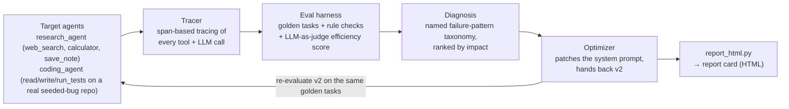

<p align="center">
  
</p>

AgentLens profiles, evaluates, and optimizes other LLM agents. Point it at an
agent and a set of benchmark tasks, and it traces every tool call and token,
diagnoses *why* the agent is inefficient using a small named taxonomy of
failure patterns, rewrites the agent's prompt to fix what it found, and
proves the fix worked by re-running the same benchmark. It reports the
before/after in a single self-contained HTML report card.

Most agent projects build something that *does* a task. AgentLens instead
watches other agents run and tells you what's actually wrong with them —
inefficient tool use, wasted tokens, unnecessary retries — and fixes it
automatically.

## A field guide to agent failure patterns

Four named, detectable patterns, each with a concrete fix:

| Pattern | What it looks like | Why it's expensive | The fix |
|---|---|---|---|
| **Prompt Bloat** | The agent's reasoning text restates the task and its own plan at length before every tool call | Inflates output tokens on *every* step, not just the wasteful ones — the highest-frequency, lowest-visibility cost in the whole run | Instruct the agent to state its action tersely, not narrate its plan |
| **Tool-Call Ping-Pong** | The agent calls the same lookup tool twice for the same (or near-identical) query | One extra full round-trip — network/API latency plus its complete token overhead — for zero new information | Instruct the agent to check its own context before repeating a call |
| **Context Rot** | The agent re-reads a file it already loaded earlier in the same run | Same waste as ping-pong, applied to file/document context instead of search | Instruct the agent to reuse content already in context |
| **Retry Storm** | The agent re-runs verification (tests, checks) after it already has a passing result | Quietly multiplies cost on every successful run, not just failures — the pattern most likely to blow up a bill unnoticed | Instruct the agent to stop as soon as its success condition is met |

Each pattern is detected from the trace data (`agentlens/eval/checkers.py`),
named and explained (`agentlens/diagnosis/patterns.py`), and has a real,
well-formed prompt-engineering fix (`agentlens/optimizer/optimizer_agent.py`)
that AgentLens applies automatically and then re-verifies.

## Real results from this repo's own eval harness

Running `python -m agentlens.scripts.run_audit` end-to-end against the two
target agents shipped in this repo produces (numbers vary slightly run to
run — the coding agent's latency comes from real `pytest` subprocess calls,
not a simulation):

| Metric | research_agent v1 → v2 | coding_agent v1 → v2 |
|---|---|---|
| Total tokens | 12,262 → 6,877 (**-44%**) | 28,301 → 13,674 (**-52%**) |
| Tool calls | 24 → 18 (**-25%**) | 22 → 12 (**-45%**) |
| Avg latency | 0.4ms → 0.3ms (**-26%**) | 572ms → 194ms (**-66%**, real subprocess time) |
| Judge quality score | 0.91 → 1.00 | 0.62 → 1.00 |
| Task success rate | 100% → 100% (never regressed) | 100% → 100% (never regressed) |

Every one of these numbers comes from actually running the code in this
repo — see "Why a mock provider?" below for what that means and doesn't mean.

## Architecture



Every LLM call in the system — target agents, the judge, the optimizer —
goes through one shared `LLMClient` interface (`agentlens/llm/client.py`), so
the tracer, harness, diagnosis, and optimizer code never know or care whether
they're driving a script or a real model.

## Why a mock provider?

This sandbox has no `ANTHROPIC_API_KEY`, and pinning the whole project to
needing one from minute one would make the interesting parts — the tracer,
the eval harness, the diagnosis taxonomy, the optimizer — impossible to
demo or test without paying for API calls on every run. So `AGENTLENS_LLM_PROVIDER
=mock` (the default) drives the exact same `LLMClient.generate()` call site
with a deterministic, offline stand-in instead of a real model call.

Two things are important about how that mock is built, because they're what
keep the before/after numbers honest rather than fabricated:

1. **Token counts are computed generically** (`estimate_tokens()` in
   `agentlens/llm/client.py`) from the actual size of the prompts and
   messages passed through the client — not hand-set per scenario. A more
   verbose system prompt genuinely costs more simulated tokens; a shorter,
   fixed one genuinely costs fewer. The optimizer isn't graded against a
   fake scoreboard.
2. **The coding agent's tool calls are real** (`agentlens/tools/coding_tools.py`).
   `read_file`/`write_file` touch real files in a per-run temp copy of
   `sandbox_repo/`, and `run_tests()` shells out to a real `pytest`
   subprocess against four genuinely seeded bugs. Only the *decision* of
   what to do next is scripted (`agents/research_agent.py`,
   `agents/coding_agent.py`) — gated on whether the current system prompt
   contains the specific fix for each seeded inefficiency. That gating is
   also what makes the optimizer's job well-defined and checkable: it has to
   produce a prompt containing the right instruction, not just any
   plausible-sounding rewrite.

Swap to a real model with one environment variable:

```bash
cp .env.example .env        # then add your ANTHROPIC_API_KEY
export AGENTLENS_LLM_PROVIDER=anthropic
python -m agentlens.scripts.run_audit
```

Every call site is unchanged. `AnthropicClient` (also in `llm/client.py`)
drives a real tool-calling loop against Claude instead of the scripted
policy, and `optimizer_agent.py` switches from a rule-based prompt patch to
asking Claude itself to rewrite the prompt given the diagnosis
(`_propose_patch_llm`), falling back to the deterministic fix library for
anything it doesn't address.

## Quickstart

```bash
pip install -r requirements.txt      # anthropic/streamlit/plotly are only
                                      # needed for the real-model and
                                      # interactive-dashboard paths — mock
                                      # mode needs only pyyaml + pytest
pytest                                # 11 tests: tracer, checkers, diagnoser,
                                      # and an end-to-end regression gate
python -m agentlens.scripts.run_audit
open reports/latest_report.html      # the report card
```

Optional interactive dashboard (needs `pip install streamlit`):

```bash
streamlit run agentlens/dashboard/app.py
```

## Project structure

```
agentlens/
  llm/client.py         LLMClient interface: MockClient + AnthropicClient
  tracing/tracer.py     Span/Trace — tool + LLM call instrumentation
  tools/                research tools (mock search/calculator) + real coding tools
  agents/                research_agent.py, coding_agent.py, base.py (shared loop)
  eval/                  golden tasks, rule-based checkers, LLM-as-judge, harness
  diagnosis/             the named failure-pattern taxonomy + detectors
  optimizer/              turns a diagnosis into a patched agent config
  dashboard/              static HTML report card + optional Streamlit app
  scripts/run_audit.py    the end-to-end CLI entry point
sandbox_repo/            tiny real repo with 4 seeded bugs, for the coding agent
tests/                    pytest suite, including the end-to-end regression gate
reports/                  generated JSON + HTML reports (gitignored contents)
```

## What's next

- A real second LLM-judge task with genuinely open-ended grading (the
  current judge grades efficiency against a known ideal call count, which is
  the right call for these tasks — but a harder judge-design problem is
  worth adding)
- A `agentlens check --baseline v1 --threshold 0.9` CI-gate command that
  exits non-zero on a quality regression, wired into a GitHub Action
- A third target agent in a different domain, to test whether the same four
  patterns generalize or whether new ones show up
